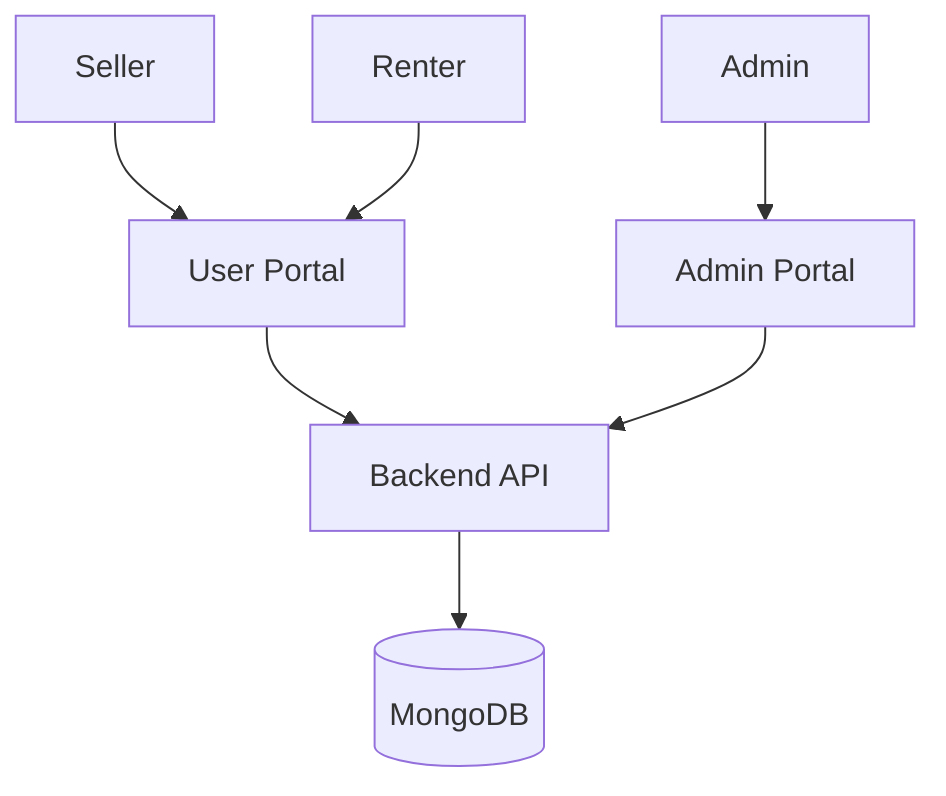

# 🌳 OrchardLease

OrchardLease is a full-stack MERN platform for renting orchards and fruit gardens.

## Tech Stack

* React + Vite + TypeScript
* Node.js + Express
* MongoDB + Mongoose
* Tailwind CSS
* JWT Authentication

---

# Project Structure

```txt
orchard_lease/

client/
admin/
server/

server/src/
├── config
├── controllers
├── middleware
├── models
├── routes
├── services
├── utils
```

---

# Architecture



---

# Core Modules

* Authentication
* User Management
* Orchard Management
* Booking System
* Admin Analytics
* Notifications
* Dashboard

---

# Roles

Seller

* Manage orchards
* View bookings

Renter

* Browse and book

Admin

* Manage users
* Moderate orchards
* View analytics

---

# Features

## User

* Signup
* Login
* Profile
* Notifications

## Seller

* Create Orchard
* Manage Listings
* Analytics

## Renter

* Search
* Wishlist
* Booking

## Admin

* Dashboard
* Moderation
* Reports

---

# Smart Orchard Recommendation Engine

OrchardLease features a production-ready, personalized Smart Orchard Recommendation Engine for renters.

## Key Recommendation Factors & Weights
- **Booking History (30%)**: Matches fruit varieties, regions, and price ranges of user's past bookings.
- **Wishlist & Recently Viewed (20%)**: Matches bookmarked and recently viewed orchards.
- **Preferred Fruit Varieties (15%)**: Directly matches user's preferred fruit selections.
- **Location Match (10%)**: Matches preferred district and state regions.
- **Budget Range (10%)**: Evaluates price proximity within user's target budget.
- **Renter Ratings (10%)**: Rewards top-rated orchards (`ratingAverage`).
- **Popularity (5%)**: Incorporates favourites, view counts, and featured status.

## Fallback Mechanisms
- **Guest / Cold-Start Fallback**: If user has no activity history, recommendations gracefully fall back to top-rated, popular, featured, and recently listed orchards.

## Endpoints
- `GET /api/recommendations` — Returns personalized orchard recommendations with match scores (0-100%) and human-readable match reasons.
- `GET /api/recommendations/similar/:orchardId` — Returns similar orchards based on fruit variety, region, price range, and ratings.

