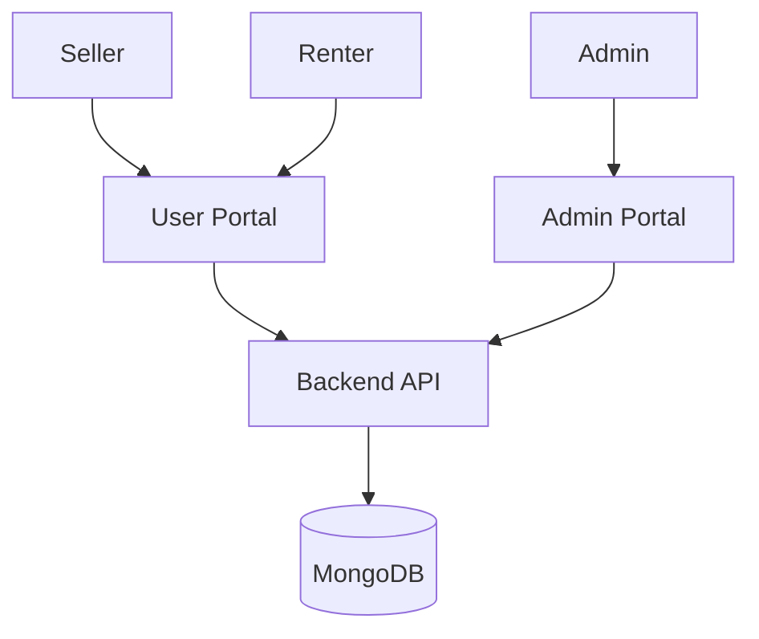
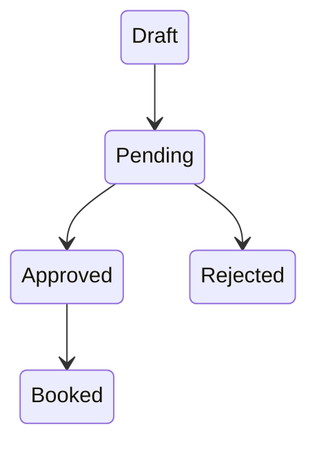

# 🌳 OrchardLease

OrchardLease is a full-stack MERN platform for renting orchards and fruit gardens.

## Tech Stack

* React + Vite + TypeScript
* Node.js + Express
* MongoDB + Mongoose
* Tailwind CSS
* JWT Authentication

---

# Project Structure

```txt
orchard_lease/

client/
admin/
server/

server/src/
├── config
├── controllers
├── middleware
├── models
├── routes
├── services
├── utils
```

---

# Architecture



---

# Core Modules

* Authentication
* User Management
* Orchard Management
* Booking System
* Admin Analytics
* Notifications
* Dashboard

---

# Roles

Seller

* Manage orchards
* View bookings

Renter

* Browse and book

Admin

* Manage users
* Moderate orchards
* View analytics

---

# Features

## User

* Signup
* Login
* Profile
* Notifications

## Seller

* Create Orchard
* Manage Listings
* Analytics

## Renter

* Search
* Wishlist
* Booking

## Admin

* Dashboard
* Moderation
* Reports

---

# Status Workflow



---

# Booking Flow

```mermaid
sequenceDiagram

Seller->>Admin:
Submit Orchard

Admin->>Seller:
Approve

Renter->>Seller:
Request Booking

Seller->>Renter:
Accept
```
